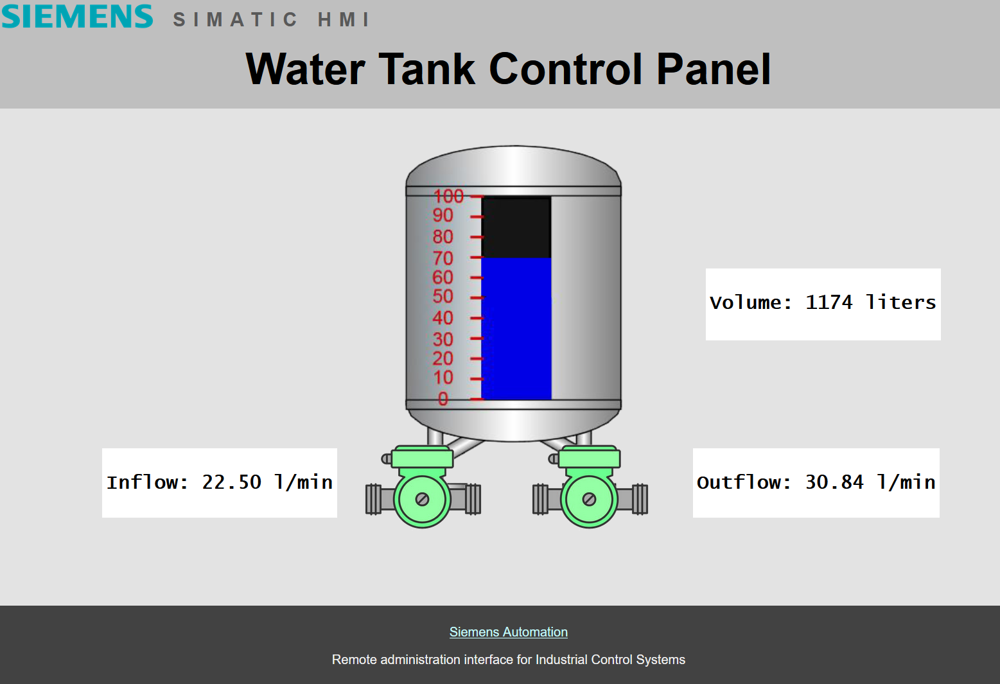

# Water Tower MiniCPS Scenario 
Water Tower is a MiniCPS Scenario based on [SWaT simulation](https://github.com/scy-phy/minicps/tree/master/examples/swat-s1) which is a subprocess of a Water Treatment testbed. 

This is a fork of [IHS/waterTower](https://github.com/CarlosLannister/IHS/tree/master/waterTower) modified to better simulate a real physical process in order to deceive the attacker.

The screenshot above shows the appearance of the modified HMI.

## Installation 
### MiniCPS simulation
0. Install [Mininet](https://github.com/mininet/mininet) and [MiniCPS](https://github.com/scy-phy/minicps). 
1. run `python init.py` script to generate the SQLite database containing the state information
1. run `sudo python run.py` to start and configure Mininet
1. execute `xterm plc2` inside the mininet terminal in order to access plc2 and run `python plc2.py` inside xterm terminal
1. come back to mininet terminal, access plc1, `xterm plc1` and run `python plc1.py` inside xterm terminal of plc1
1. come back to mininet terminal, access the root node s1, `xterm s1` and run `python physical_process.py`

### HMI web app
in a new terminal execute `python3 scada.py`. The HMI is now running at [localhost:5000](http://localhost:5000)
